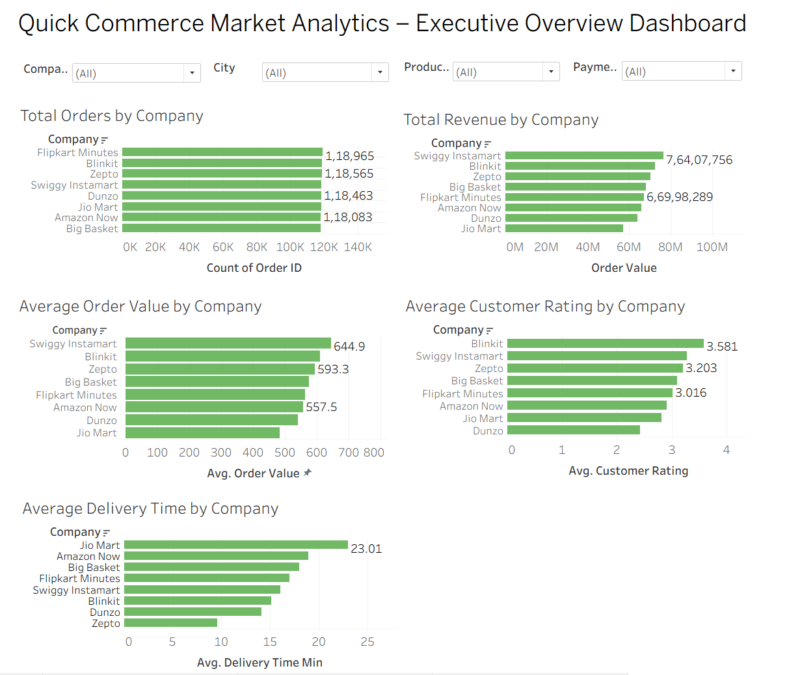
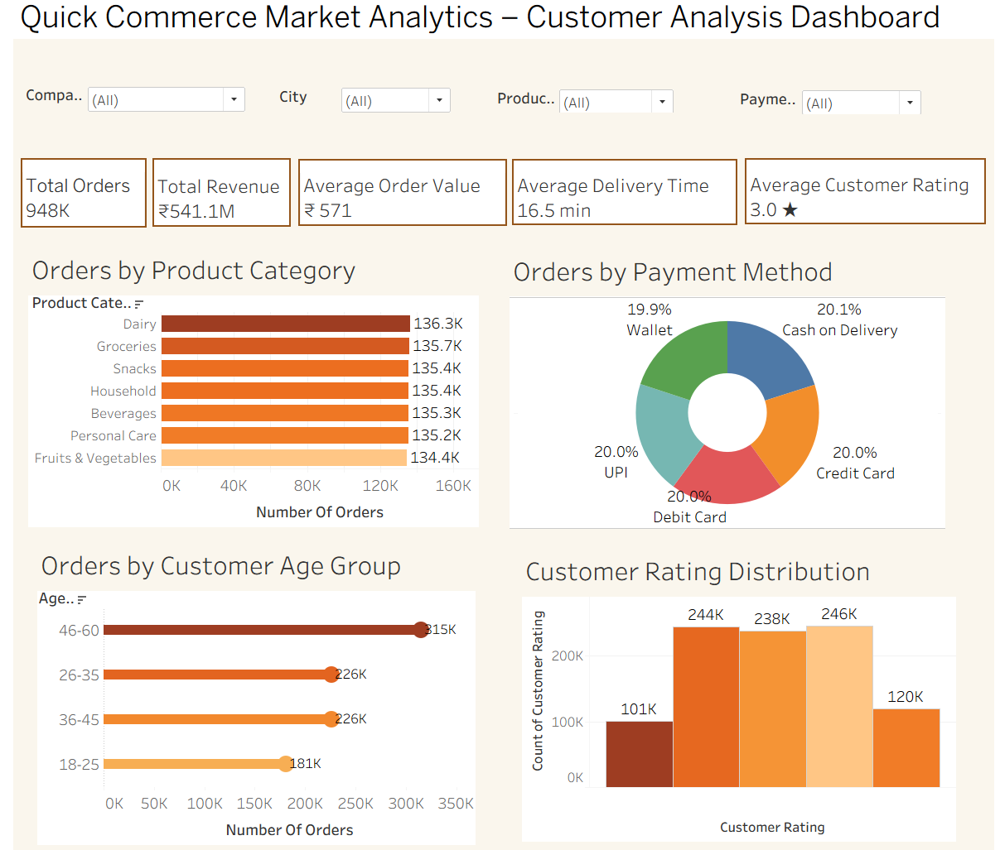
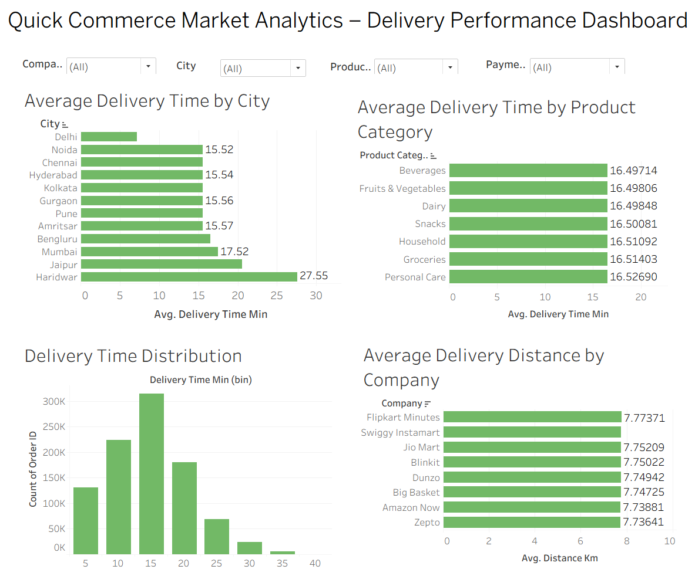

# 📊 Quick Commerce Market Analytics

## 📌 Project Overview

Quick Commerce has transformed the retail industry by enabling customers to receive groceries and essential products within minutes. This project analyzes transactional data from multiple quick commerce platforms to understand business performance, customer purchasing behavior, delivery efficiency, and product trends.

Using **Python**, **SQL**, and **Tableau**, this project performs end-to-end data analysis, generates business insights, and provides actionable recommendations to improve operational efficiency and customer satisfaction.

---

# 🎯 Business Objective

The objective of this project is to analyze quick commerce transaction data and answer key business questions such as:

- Which company receives the highest number of orders?
- Which company generates the highest revenue?
- Which company has the highest average order value?
- Which customer age groups place the most orders?
- Which payment methods are most preferred?
- Which product categories generate the highest sales?
- How does delivery performance vary across companies and cities?

---

# 📂 Dataset Information

**Dataset:** Quick Commerce Transactions

**Number of Records:** 947,752

**Number of Features:** 13

### Dataset Attributes

- Order ID
- Company
- City
- Customer Age
- Order Value
- Delivery Time (Minutes)
- Distance (Km)
- Items Count
- Product Category
- Payment Method
- Customer Rating
- Discount Applied
- Delivery Partner Rating

---

# 🛠 Tools & Technologies

| Tool | Purpose |
|------|---------|
| Python (Pandas, NumPy, Matplotlib) | Data loading, cleaning, validation, exploratory data analysis |
| MySQL | Business analysis using SQL queries |
| Tableau | Interactive dashboards and business visualization |
| Microsoft Excel | Initial dataset inspection |
| Microsoft Word | Project documentation |
| GitHub | Project version control and portfolio |

---

# 📁 Project Structure

```text
Quick-Commerce-Market-Analytics/
│
├── dataset/
│   └── task1_commerce.csv
│
├── report/
│   ├── Quick_Commerce_Report.docx
│   └── Quick_Commerce_Report.pdf
│
├── sql/
│   └── business_queries.sql
│
├── python/
│   └── quick_commerce_analysis.ipynb
│
├── tableau/
│   └── Quick_Commerce_Dashboard.twbx
│
├── images/
│   ├── executive_overview_dashboard.png
│   ├── customer_analysis_dashboard.png
│   └── delivery_performance_dashboard.png
│
└── README.md
```

---

# 🔄 Project Workflow

```text
Raw Dataset
      │
      ▼
Python
(Data Loading, Cleaning & Exploratory Data Analysis)
      │
      ▼
SQL
(Business Queries & KPI Analysis)
      │
      ▼
Tableau
(Interactive Dashboards)
      │
      ▼
Business Insights & Recommendations
```

---

# 🐍 Python Analysis

Python was used for:

- Loading the dataset
- Data inspection
- Data cleaning and validation
- Missing value analysis
- Duplicate record detection
- Statistical summary
- Exploratory Data Analysis (EDA)
- Basic visualizations
- Business insight generation

---

# 💾 SQL Analysis

The SQL analysis includes **30 business queries** covering:

### Business Overview

- Total Orders
- Total Revenue
- Average Order Value
- Number of Companies
- Number of Cities
- Product Categories

### Company Performance

- Revenue by Company
- Orders by Company
- Average Order Value
- Customer Ratings
- Delivery Performance

### Customer Analysis

- Orders by Age Group
- Revenue by Age Group
- Preferred Payment Methods
- Product Category Distribution

### Delivery Analysis

- Average Delivery Time
- Fastest & Slowest Company
- Delivery Distance Analysis

### Advanced SQL

- CASE Statements
- GROUP BY
- HAVING
- Subqueries
- Window Functions (RANK)

---

# 📊 Tableau Dashboards

This project contains **three interactive dashboards**.

## Dashboard 1 – Executive Overview

Provides an overview of:

- Revenue by Company
- Total Orders
- Average Order Value
- Customer Ratings
- Company Performance



---

## Dashboard 2 – Customer Analysis

Analyzes:

- Customer Age Distribution
- Payment Methods
- Product Categories
- Customer Ratings



---

## Dashboard 3 – Delivery Performance

Analyzes:

- Delivery Time
- Delivery Distance
- Company-wise Delivery Performance
- Delivery Partner Ratings



---

# 📈 Key Business Insights

- Company performance varies significantly in terms of revenue and order volume.
- Customer purchasing behavior differs across age groups.
- Digital payment methods are the most preferred payment option.
- Certain product categories contribute a major share of total sales.
- Delivery efficiency directly impacts customer satisfaction.
- Companies with higher delivery partner ratings generally receive better customer ratings.

---

# 💡 Business Recommendations

- Improve delivery efficiency through optimized delivery routes.
- Promote high-performing product categories using targeted marketing campaigns.
- Increase average order value through bundle offers and personalized discounts.
- Focus customer retention strategies on high-value customer segments.
- Monitor key business metrics continuously using interactive dashboards.

---

# ⚠ Project Limitations

- The analysis is based on a public dataset.
- The dataset contains simulated transactional data.
- Seasonal trends were not analyzed.
- Weather conditions and holiday effects were not included.
- Customer retention history was unavailable.

---

# 🚀 Future Scope

- Develop sales forecasting models.
- Perform customer segmentation using machine learning.
- Build customer churn prediction models.
- Implement demand forecasting techniques.
- Develop real-time business dashboards.
- Integrate predictive analytics for decision-making.

---

# 📌 Conclusion

This project demonstrates an end-to-end data analytics workflow using Python, SQL, and Tableau. The analysis provides valuable business insights into company performance, customer behavior, delivery operations, and product trends while showcasing practical data analysis, visualization, and business intelligence skills.

---

# 👩‍💻 Author

**C.S.Rachel**

**M.Sc. Data Science**

---

⭐ **If you found this project useful, feel free to explore the repository and connect with me on GitHub!**
